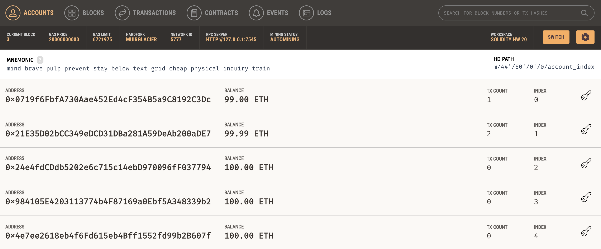
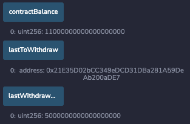
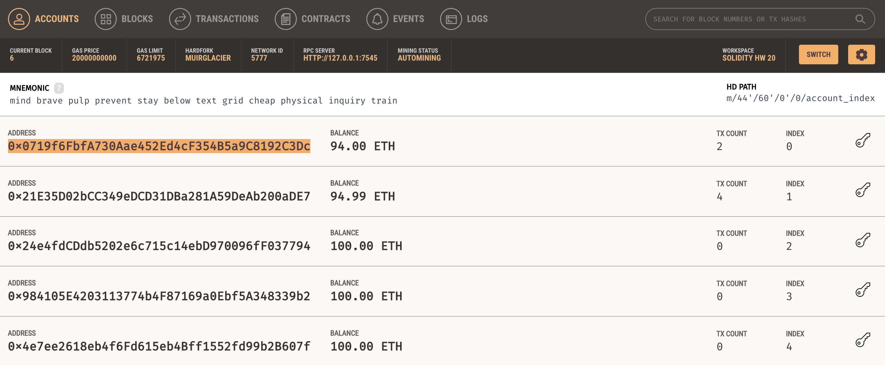

# Unit 20 - "Joint Savings Account"

## Steps to Test:
Initial Balance of Accounts (Ganache):

1. Deployed contract on Remix with account: 0x21E35D02bCC349eDCD31DBa281A59DeAb200aDE7
2. Used the `setAccounts` function to define the authorized Ethereum addresses that will be able to withdraw funds from your contract.
Set Accounts:
- 0x0719f6FbfA730Aae452Ed4cF354B5a9C8192C3Dc (aka Solidity HW1)
- 0x21E35D02bCC349eDCD31DBa281A59DeAb200aDE7 (aka Solidity HW2) 
Contract Balance and Account Balance: 
 
 
3. Transaction 1: Send 1 ether from Solidity HW1 
Contract Balance and Account Balance: 
 
 
4. Transaction 2: Send 10 ether from Solidity HW1 
Contract Balance and Account Balance: 
 
 
5. Transaction 3: Send 5 ether from Solidity HW2 
Contract Balance and Account Balance: 
 
 
6. Transaction 4: Withdraw 5 ether into Solidity HW1 
Contract Balance and Account Balance: 
 
 
7. Transaction 5: Withdraw 10 ether into Solidity HW2 
Contract Balance and Account Balance: 
 
 