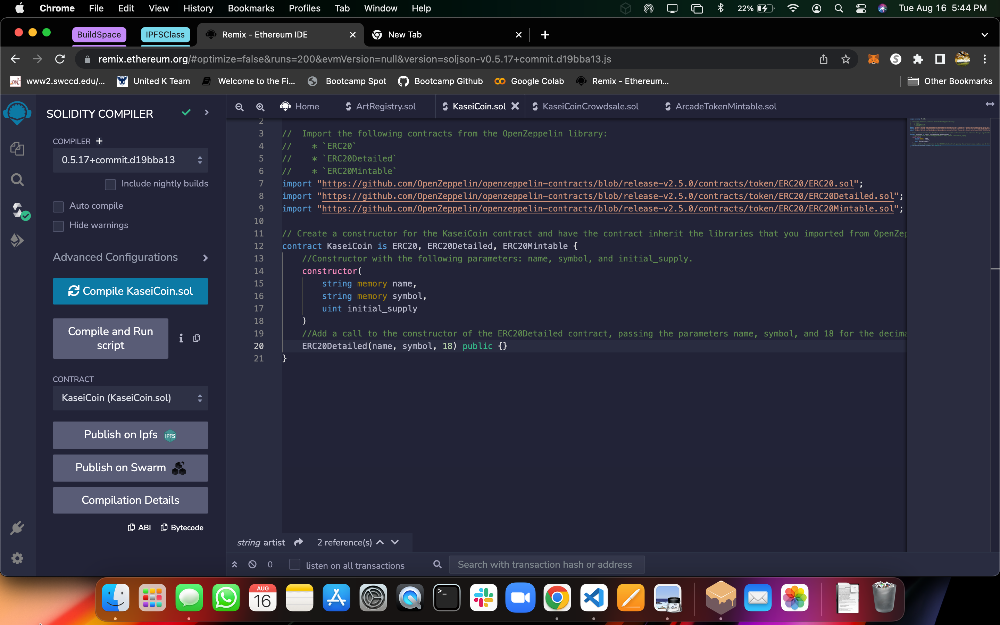

# Unit 21: Martian Token Crowdsale

KaseiCoin is a fungible token that’s ERC-20 compliant. I launched a crowdsale that will allow people who are moving to Mars to convert their earthling money to KaseiCoin.

This token can be minted by using a `Crowdsale` contract from the OpenZeppelin Solidity library.

The crowdsale contract manages the entire crowdsale process. This process allows users to send ether to the contract and receive KaseiCoin tokens, or **KAS**, in return. 

## Steps

### Step 1. Created the KaseiCoin Token Contract
- Imported the following contracts from the OpenZeppelin library:
    * `ERC20`
    * `ERC20Detailed`
    * `ERC20Mintable`

- Inside the `KaseiCoin` contract, I added a constructor with the following parameters: `name`, `symbol`, and `initial_supply`
- Added a call to the constructor of the `ERC20Detailed` contract, passing the parameters `name`, `symbol`, and `18`

Successfully Compiled: 
 

### Step 2. Created the KaseiCoin Crowdsale Contract
- This contract inherits the following OpenZeppelin contracts:
    * `Crowdsale`
    * `MintedCrowdsale`

- The `KaisenCoinCrowdsale` constructor, provides the parameters for all the features of your crowdsale, such as `rate`, `wallet` (where to deposit the funds that the token raises), and `token`

Successfully Compiled: 
 

### Step 3. Created the KaseiCoin Deployer Contract
- The `KaseiCoinCrowdsaleDeployer` contract in the provided `KaseiCoinCrowdsale.sol` starter code.
- I add variables to store the addresses of the `KaseiCoin` and `KaseiCoinCrowdsale` contracts, which this contract will deploy
- Added the following parameters to the constructor for the `KaseiCoinCrowdsaleDeployer` contract: `name`, `symbol`, and `wallet`
- Set the `KaseiCoinCrowdsale` contract as a minter.
- Have the `KaseiCoinCrowdsaleDeployer` renounce its minter role.

### Step 4. Deployed and Tested the Crowdsale on a Local Blockchain
Video for Testing:

### Step 5. Extended the Crowdsale Contract by Using OpenZeppelin
- I added to the crowdsale contract to enhance its functionality by using the following OpenZeppelin contracts:
    * The `CappedCrowdsale` contract: Allows to cap the total amount of ether that your crowdsale can raise.
    * The `TimedCrowdsale` contract: Allows to set a time limit for your crowdsale by adding an opening time and a closing time.
    * The `RefundablePostDeliveryCrowdsale` contract: Allows to refund your investors. Every time that you launch a crowdsale, you set a goal amount of ether to raise. If you don’t reach the goal, it’s a common practice to refund your investors.
- In the `KaseiCoinCrowdsale` constructor, I added the following parameters:
    * The `uint goal` parameter: The amount of ether that you hope to raise during the crowdsale&mdash;that is, the goal of the crowdsale.
    * The `uint open` parameter: The opening time for the crowdsale.
    * The `uint close` parameter: The closing time for the crowdsale.
Video for Testing:

